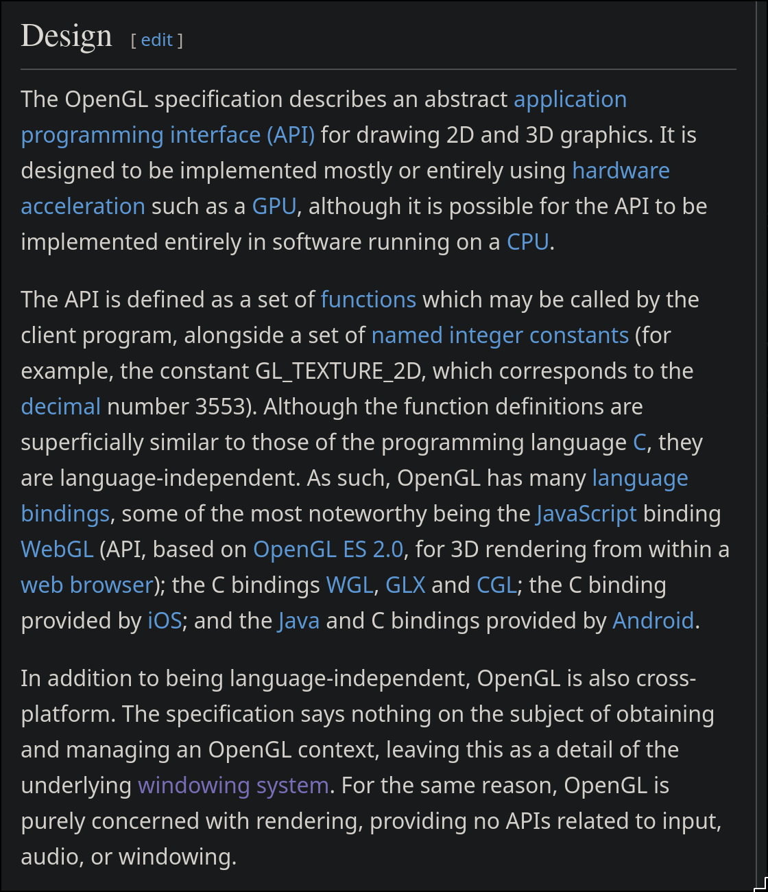
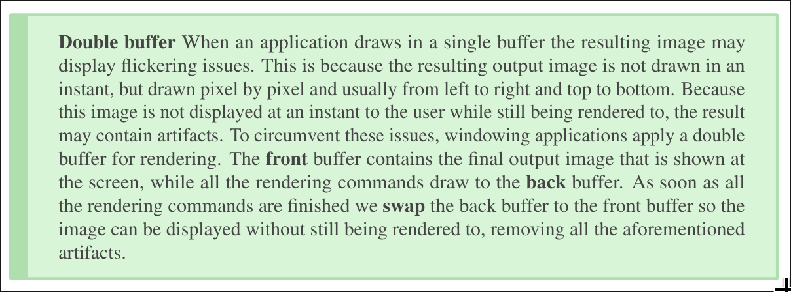

OpenGL isn't actually a library or anything. It's a specification
A Spec, it defines functions and says that it must have these parameters,
and that it returns this and that. There is no code. It is simply an API

The ones who implement it are the graphics manufacturers like NVIDIA or AMD
or Intel

openGL relies on the host OS to create a window and we use SDL
to handle this cross-platform

now we need to render graphics onto it

we have two choices that will dictate the architecture of the renderer
we can use OpenGL for the rendering(manual and we need to take care of the
steps during the pipeline, buffers, and memory) or we can use SDL's rendering
API via SDL_CreateRenderer

www.khronos.org/opengl/wiki/OpenGL_Loading_Library

we can use <SDL3/SDL_opengl.h> for the binding

OpenGL also has many versions and each provides many possible functions
to be used, to ensure that all OpenGL functions are available on all OS,
The OS doesn't directly give you all OpenGL functions so we need to ask the
graphics driver (NVIDIA/AMD/Intel/Mesa) at runtime for the functions' address

Using an OpenGL loading library automatically fetches it for us. 
examples are GLAD, or GLEW

because we are using the native implementation of OpenGL, we are using the GPU
manufacturers' implementation. We want to be able to use all of them regardless
of whichever host OS we're running this on. We need to go into the drivers,
pull out the functions, and call them.

This means getting the function declarations and link against those functions.

This is what it means by getting the function pointers to the function inside
the libraries

we could do it manually, but it would not be cross-platform, that's why we'll
be setting up an opengl loader library

this library provides opengl API spec declarations, function declarations,
constants, &c.,and behind the scenes, the actual implementation of the library,
it identifies the what graphics driver you're using, finds the appropriate
<function?>, and loads those function pointers

---

opengl is just one large state machine and opengl's context is its current state
the functions that draw triangles &etc, are just changing the state

---

while learning graphics programming, we encounter a concept called double buffer
like front and back buffer when displaying onto the frame buffer and this makes
sense when we try to think about it, even if a GPU is extremely fast, it'll take
time to process all the pixels if it were to just use a single buffer in the
frame buffer. You'd be able to see the flickering and lag of pixels. This would
be more so apparent on software rendering if done by the CPU. Double Buffer
solves this issue by having two buffers that continously swap. The front which
is current in display and the back buffer which is processed. When the back
buffer is done, they swap with each other making it smoother

