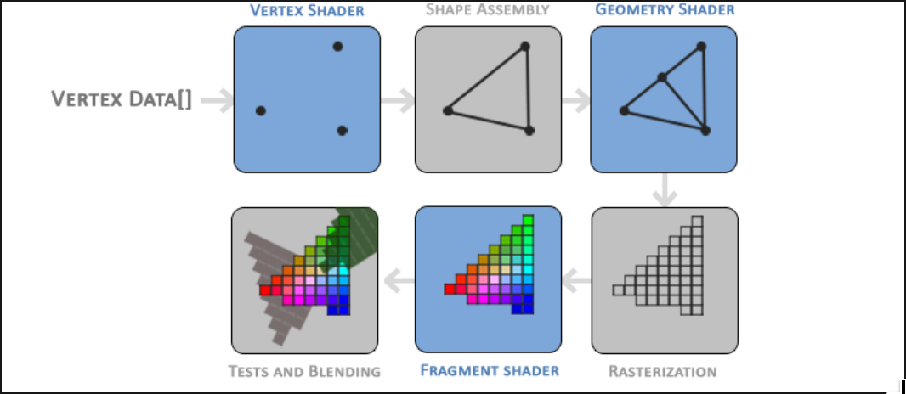
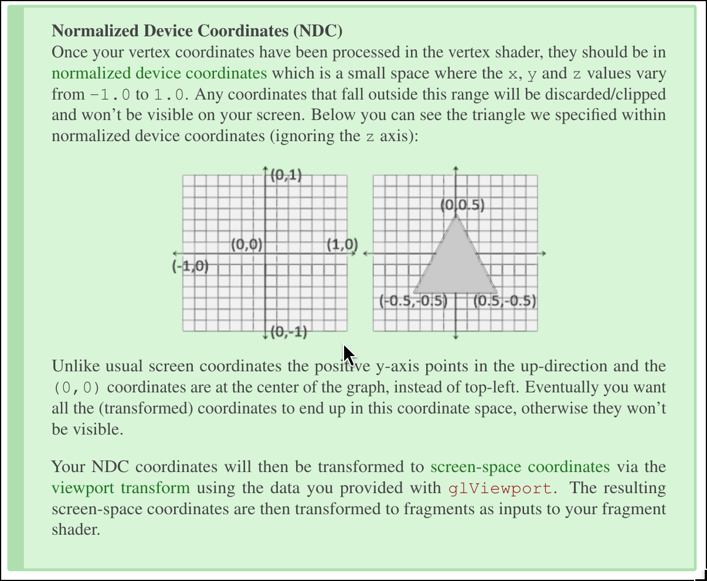

on OpenGL

everything in GL is in 3D space but the screen/window is a matrix of pixels
a 2D array. Large part of OpenGL's work is to transform all 3D coordinates
to 2D pixels that fit on your screen

this is managed by the graphics pipeline

it can be split into two large parts
1. transform 3D coordinates into 2D coordinates
2. transform 2D coordinates into actual colored pixels

shaders are the programs that run directly on the GPU

to explain the pipeline futher
1. vertex shader -> takes as input a single vertex. It transforms 3D coordinates
into different 3D coordinates with basic processing on vertex attributes

2. primitve assembly -> takes all the vertices/vertex from the vertex shader
that form a primitive and assembles all the point/s in the primitive shape
given. the output is passed to the next stage in the pipeline

3. geometry shader -> takes a collection of vertices/vertex that form a primitive
and has the ability to generate other shapes by emitting new vertices to form new
or other primitive/s. It then passes its output to the next stage in the pipeline

4. rasterization stage -> maps resulting primitive/s to the corresponding pixels
on the final screen, resulting in fragments for the fragment shader to use. Before
the fragment shader runs, **clipping** is performed to remove fragments outside
your view, increasing performance

**A fragment** in OpenGL is all the data required for OpenGL to render a single
pixel

5. fragment shader -> calculates the final color of the pixel and this stage is
usually where advanced OpenGL effects occur.
Includes data like lights, shadows, color, &c..

6. alpha test & blending stage -> final stage that checks the corresponding
depth (and stencil) value of the fragment and uses those to check if the resulting
fragment is in front or behind other objects and should be discarded accordingly
it also checks for alpha values and blends the object accordingly 

---

OpenGL requires us to define atleast a vertex and fragment shader of our own

keyterm:
- normalized device coordinates

