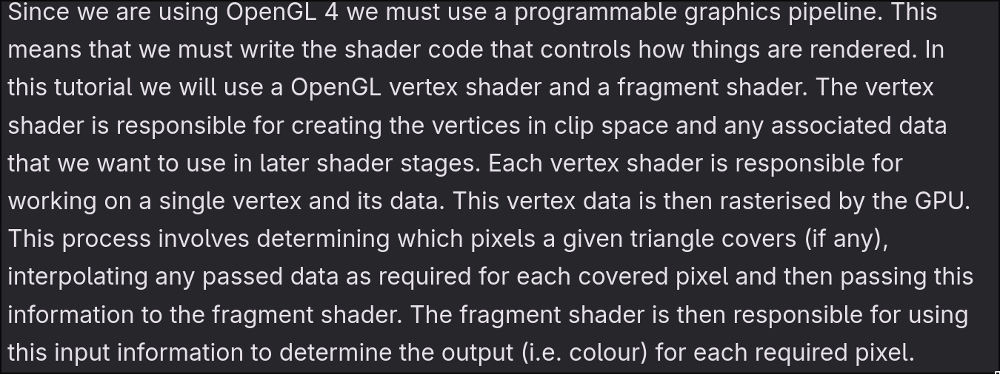
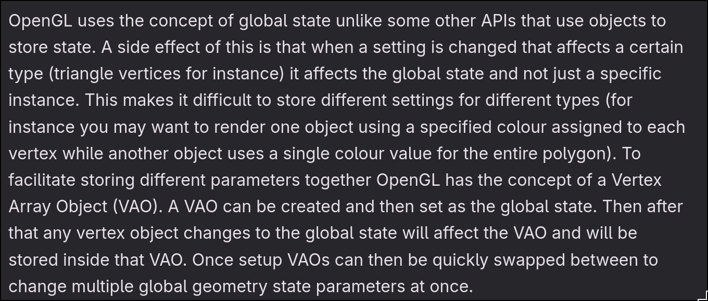
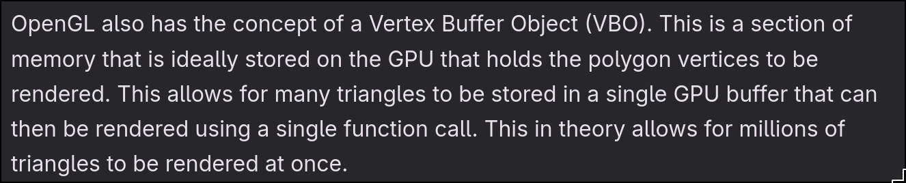
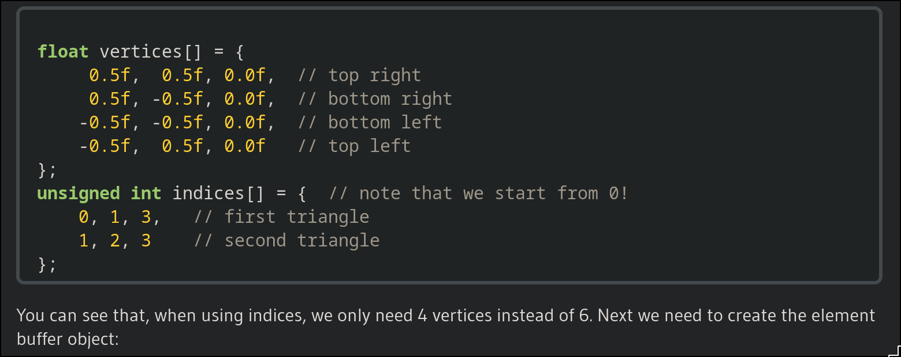
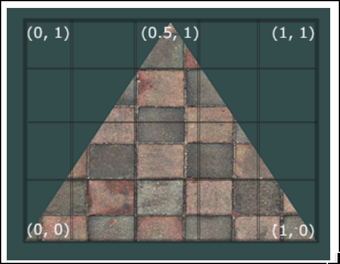

## Simplified overview of graphics pipeline

- this means that the Graphics Pipeline necessitates both a vertex shader
and a fragment shader

## Use of VAO

- making changes affect not only the instance but also the global state
so in order to

- a container that contains the bindings of VBOs(where VBOs are just arrays of data)
- because VBOs are simply arrays of data, or just arrays of numbers,
 it can only be initerpreted by the VAO, which is why the VAO stores
 that interpretation, e.g:
    - “Interpret every 3 floats as a position”
    - “Interpret every 3 floats in another VBO as a normal”
    - “Interpret every 2 floats in yet another VBO as a UV”

- simply it stores the interpretation of VBOs

## Use of VBO

- VBO is used to store vertices in a single object which can then be
rendered at once using the GPU so you don't need to render every vertice
one by one. This is similar to batching?

- we store a single polygon here which is attached to the VAO
 so we can render thousands of triangles by making VBOs
 and attaching them to a VAO that decides the global state

 - in reality, it's not actually full polgyons but points, or numbers, just
 arrays of numbers without amny interpretation

## Use of EBO

Element buffer object
OpenGL works primarily with triangles but because of the nature of the game
being composed of pixels -> meaning we work with quads instead of triangles
we end up reusing vertices during the construction of a rectangle when
passing in vertices to the vertex shader

ebo allows us to store the indices instead and does indexed drawing

## textures

"A texture is a 2D image (even
1D and 3D textures exist) used to add detail to an object; think of a texture as a piece of paper with a
nice brick image (for example) on it neatly folded over your 3D house so it looks like your house
has a stone exterior. Because we can insert a lot of detail in a single image, we can give the illusion
the object is extremely detailed without having to specify extra vertices."

each vertex should then have a texture coordinate associated with it so we
can specify what part of the texture image to sample from. Fragment interpolation
then handles the rest for the other fragments

the texture coordinate goes from 0 to 1 on both x and y axis

it is our job to tell OpenGL how it should **sample** the textures

texture wrapping
texture filtering (texels)
 ### mipmaps
textures that are very far away and not visible should not be fully
rendered in as it's a waste of memory bandwidth
OpenGL's mipmaps solves this. it is a collection of texture images where
each subsequent texture is twice as small compared ot the previous one.
we can do it manually or we can have OpenGL set it up for us.

