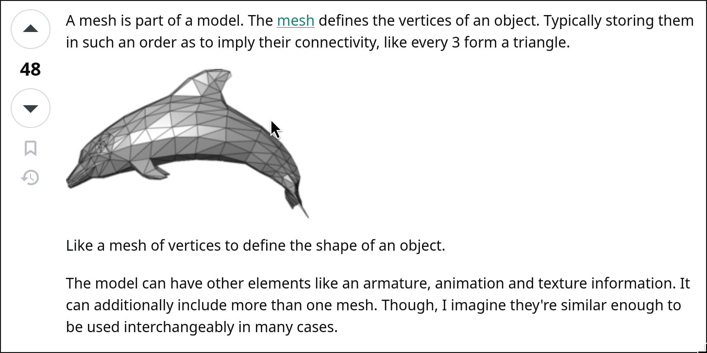

# process

# Meshes, Textures, makes a what?
vertices makes meshes(polygons)
https://en.wikipedia.org/wiki/Polygon_mesh



textures can be applied to meshes (during fragment shader)
meshes bundled with textures are models (sprites in 2d)

models simply bundle up the textures and meshes, as such, models are simply 
just how a shape looks

# Models, but what about the transformation?

because models simply bundle data that deals with how it visually looks
they do not include how they are transformed, nor other extra information
that could be of use, this means that we are bridging away from graphics
programming onto the realm of game programming and one more layer of
abstraction must be made.

models (or now, we can use the word assets as a bundle of texture and meshes 
when dealing with games), are all rendered either once at the 
beginning of a game or lazily during loading screens where we discard unused 
models and load in new ones.

Models, or in games, often called  "assets" or "resources" are simply just 
static reusable data 

...
However, models alone cannot describe where or how something should exist in
a scene. To use a model in such a way would necessitate attaching it to
another abstraction: the **entity**
...

Entities are instances of those assets in the world. They provide the runtime 
context of models, defining their transformation(position, scale, and rotation)
as well as attributes like behaviours or animations

Entities are the breakaway from graphics programming as they deal with the 
real-time transformation(or not if they are static) as well as animations if 
they necessitate them as well.

these transformations map to how shapes are transformed in geometry which means
we must go back to geometry, and where we'll encounter linear algebra for the
first time

On the math behind transformations(graphics programming)
Read more [here](math.md)


## why is entities the demarcation line between graphics programming and game programming?

Graphics Programming is really just about how something is drawn on a screen.
It is only concered with the GPU (unless we talk about software rendering).
It has no concept of the entity, the behaviours of a living object(and if we were
to follow the industry), about writing with graphics APIs, it is as close to
GPU assembly that we can get without needing to write our own graphics drivers

```
Graphics programming is a field of computer science that focuses on creating and
manipulating visual content, such as images, animations, and videos, using a 
computer. It involves designing and implementing algorithms, techniques, and 
tools to generate and render graphical objects and scenes in real-time or 
offline.
```
https://thatonegamedev.com/cpp/what-is-graphics-programming/

Graphics Programming is also about the Rendering Pipeline, the transformation of
vertices to fragments to pixels on the visible screen

### so game programming?

But game development, and game programming, (although built off graphics
programming, it is not limited to it), it deals with entities, how they live
inside a scene, their behaviours, the physics, gameplay logic, and AI.

# going back then!

Now that game programming and graphics programming have been differentiated,
Entities, which belong to the realm of games, not only hold the models, but
behaviours.  These bavhiours are not thought of as functions in OOP but as flags 
for the actions they are doing, their status, &etc.

However, bundling all types of behaviours to a single entity can cause issues
that can be seen in minecraft where armour stands are treated as mob entites

Therefore, there shouldn't just be a SINGLE entity, but differentt types.

But then we fall back into OOP land where we declare a single "parent" entity.
For an academic capstone project, one that's based on C and OpenGl, we want to
avoid this. Not only because C is not OOP(which is a good thing), but also
because of criticisms towards OOP. That is, OOP was designed as a way of
businesses to encapsulate data, hiding it away, and making it inacessible
to the users and especially the computer.

OOP is also said to map how the real world works, but the real world does not
represent how computers operate, and computers, in assembly, everthing is
public. Nothing is private. Function overloading also abstracts away 
... <TBD>
is also a misused concept
that abuses computers

OOP isn't however evil in that sense, but it doesn't reprsent how hardware
and the software that we create actually work

# before we continue, we need to learn about coordinates


first we must wrestle with some ideas

the resolution of the window is not the same as the resolution of the renderer
the renderer's resolution can be thought of as the virtual resolution, that is
the size that the models will be mapped to

there is no limitation to it being smaller, bigger, or exact to the window size
hence the window size can be whatever but the renderer resolution is the same
the renderer's resolutionn is independent of the window and is where everything
rendered by the GPU will live

if our tilesheet sprites are 16x16 per cell

we can determine how many sprites can be rendered and what resolution is needed

virtual width = 16 * 32 blocks = 512
virtual height = 16 * 20 blocks = 320

we thus have the location that we can model the model matrix for which maps to
the world space

# what's next?

the next thing we need to figure out is, once we create the entities, who exactly 
owns it? renderer shouldn't really own it as it's not exactly a "GPU resource"
it shouldn't really manage the states of entities like transformation matrices,
though it should certainly operate on them to figure out where they should be 
mapped on the world space.

therefore a new component must be added that will handle the management of run
time objects. this can go by any names but the one chosen will be **scene** 
representing the graphical scene.

because scene holds entities during runtime, we cannot know exactly how many
we must store or a buffer size to hold all of them. This issue cannot be done
with a statically allocated array on the stack but instead a heap-allocated
array, and not just any type of array but an array list to give us the ability 
to extend or shrink its sized during runtime

> why not use a stack or just a big buffer array? it's a waste of memory to 
> statically allocate a big buffer on the stack especially if we don't use it 
> all, and worse, if we end up using more than
> what's allocated !!!! BUFFER OVERFLOW

to store the entities , i'll be needing to use a dynamic array because whenever
we need to destroy the model, it'll end up leaving empty gaps in a normal array
which will become a headache to deal with early on when we have more than
several objects that must be tracked

# first with the entity

an entity is simply a lightweight container that holds a reference to the 
model it's using, the behaviours, animations, and transform matrices
transform matrice including the
    - translate (position)
    - scale
    - rotation

the entity itself can hold a pointer that directly references the model we wish
to use for it but issues can arise when wanting to change its model during time,
it's especially apparent as models have been stored inside of an array. A better
idea insteead of dealing with raw memory addresses, is to store the index that
maps to the corresponding model (which we can use enums to handle)

this avoids dealing with memory addresses, saves the computer having to
derefence pointers, and allows us to easily change the model during runtime.
This especially avoids the issues of dangling pointers if for example, the
model was freed.
